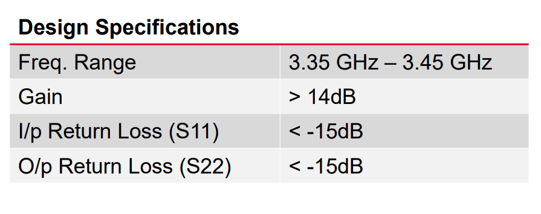
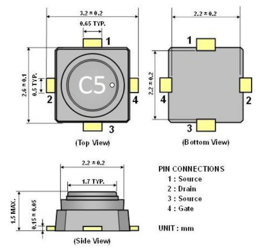
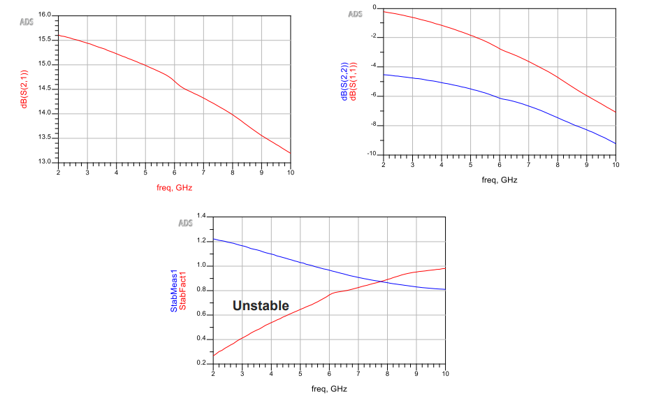
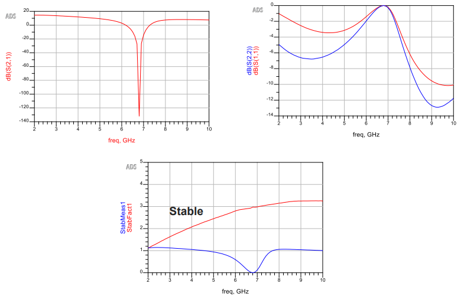
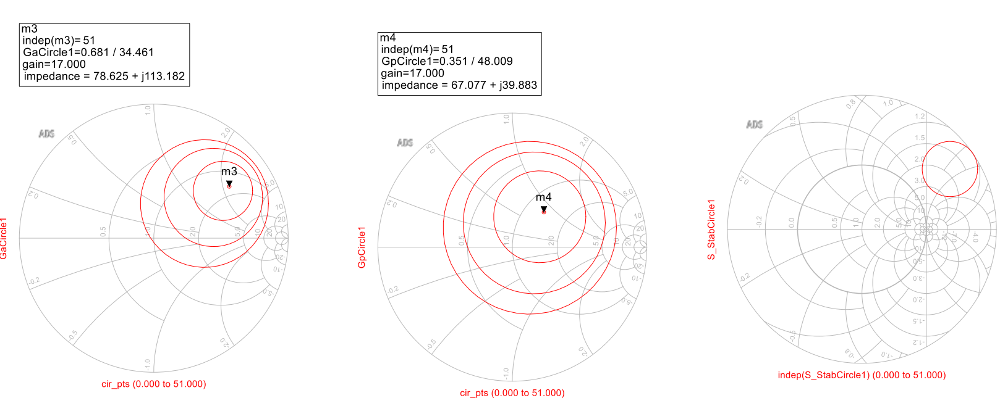
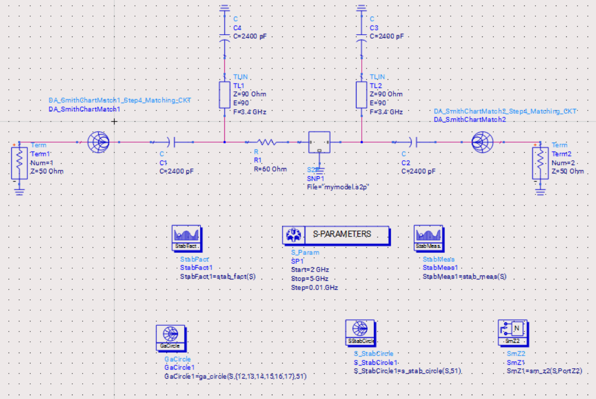
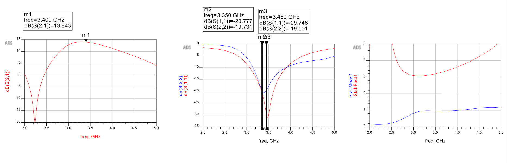
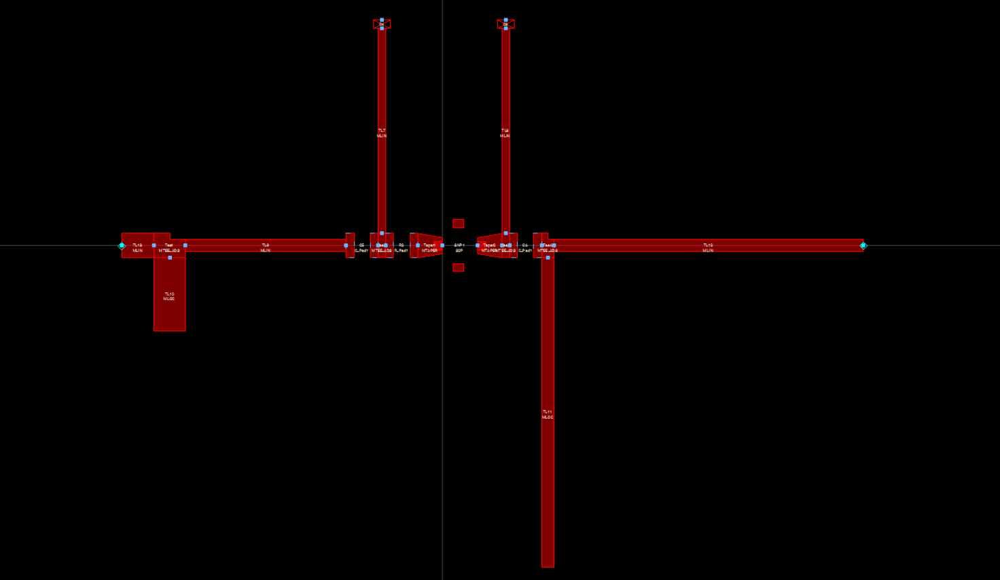
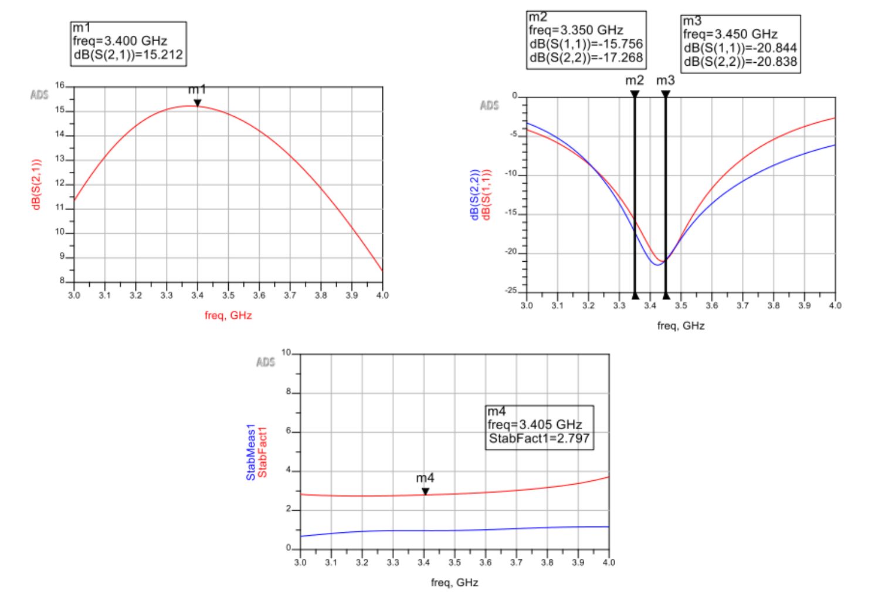
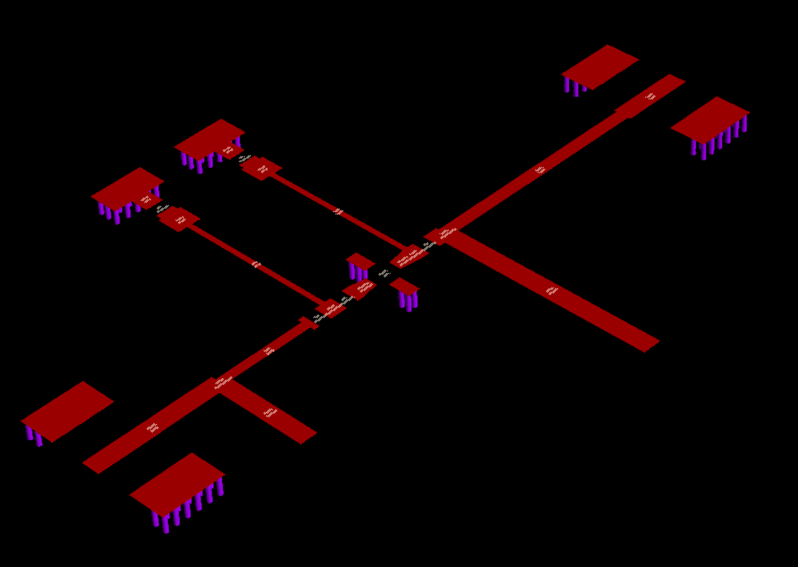

# 3.4 GHz GaAs FET RF Amplifier Design (Keysight ADS)

This project documents the complete design flow of a 3.4 GHz RF amplifier using the CE3512K2 GaAs FET in Keysight ADS.  
The goal was to design, stabilize, match, optimize, and validate the amplifier through layout and EM simulation.

---

## Design Targets

- Frequency Band: 3.35 – 3.45 GHz  
- Gain > 14 dB  
- S11 < -15 dB  
- S22 < -15 dB  

---

## Device Used

CE3512K2 GaAs FET was used as the active device.  
S2P data provided by the manufacturer was imported into ADS for analysis.

---

## Step 1: Initial S-Parameter Analysis

The raw device response showed instability around the target frequency band.  
Stability factor analysis confirmed that additional stabilization was required.

---

## Step 2: Stability Network Design

A resistive stabilization approach was implemented along with biasing circuitry.  
After this modification, the amplifier became stable across the desired band.

---

## Step 3: Gain & Stability Circle Analysis

Gain circles and stability circles were plotted at 3.4 GHz.  
Source and load reflection coefficients were selected from the Smith Chart to meet gain requirements while maintaining stability.

---

## Step 4: Matching Network Design

Microstrip-based input and output matching networks were designed.  
The initial matched response achieved the required gain but return losses required further improvement.

---

## Step 5: Optimization

Tuning and optimization were performed in ADS.  
Final results achieved:

- Improved return loss (< -20 dB)
- Gain close to target
- Stable response

---

## Step 6: Layout Generation

The schematic was converted to a microstrip PCB layout.  
Transmission line dimensions were based on defined substrate parameters.

---

## Step 7: EM Simulation

Full-wave EM simulation was performed using RFPro (FEM solver) to account for layout parasitics.

Frequency shift observed in EM simulation was compensated through re-optimization.

---

## Final Result

The amplifier design flow was completed from:

- S2P analysis  
- Stability design  
- Impedance matching  
- Optimization  
- Layout generation  
- EM validation  
- Gerber-ready output  

This project helped build practical understanding of RF amplifier design beyond schematic-level simulation.